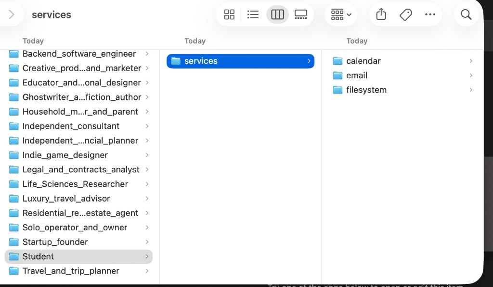
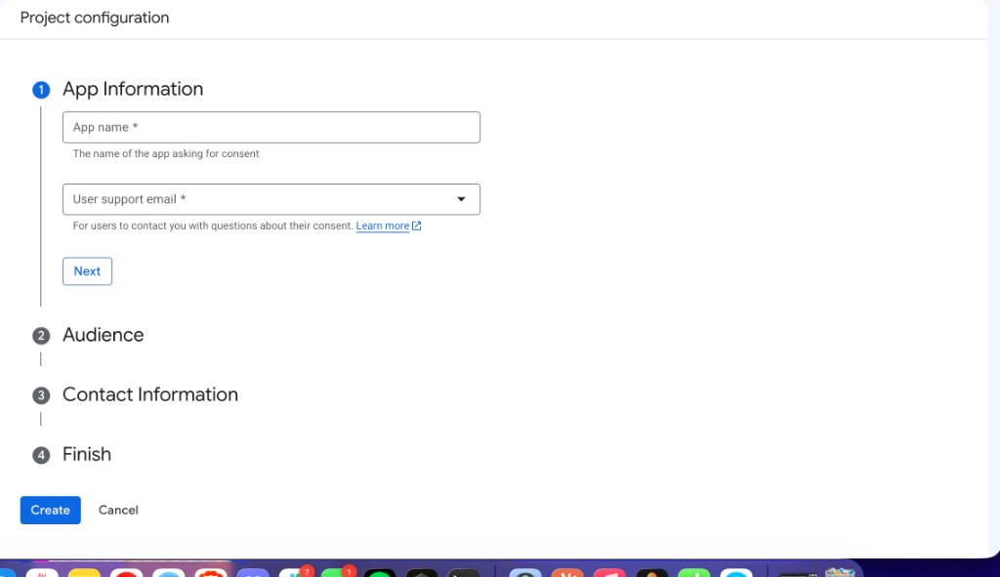
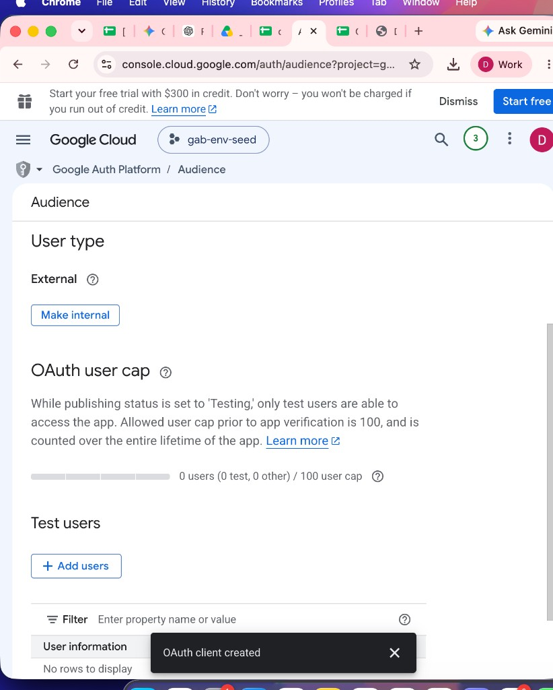
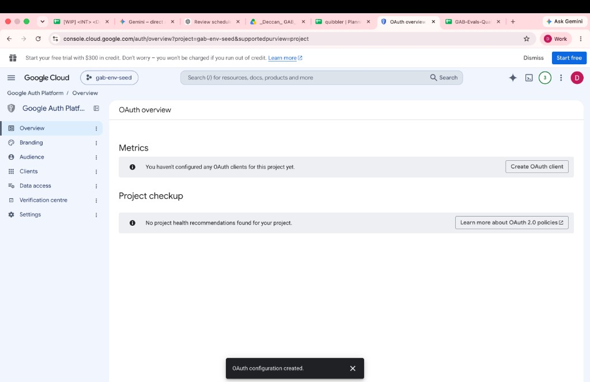
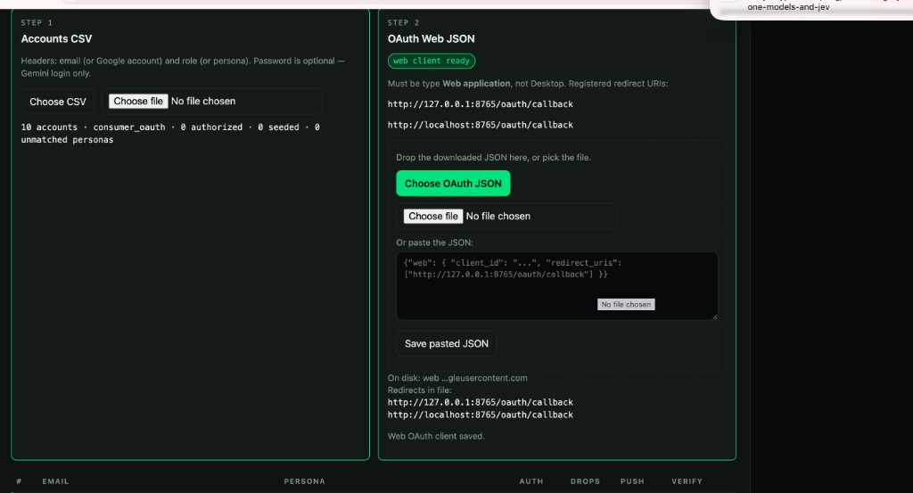
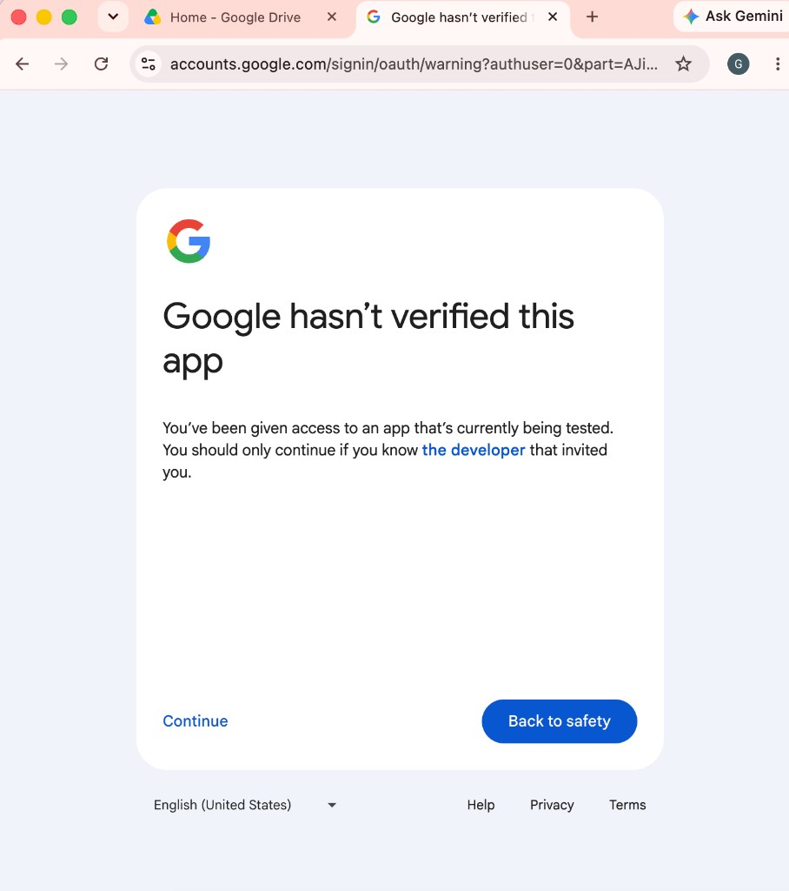
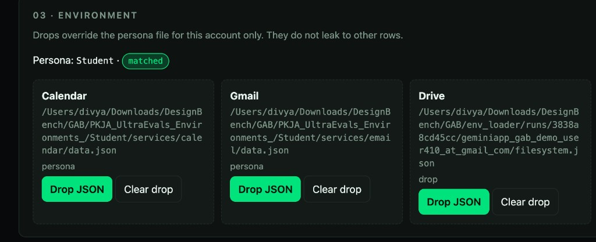
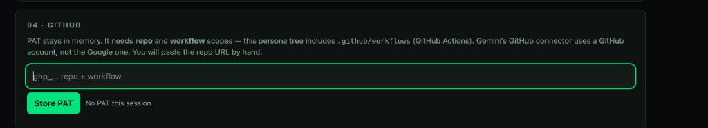
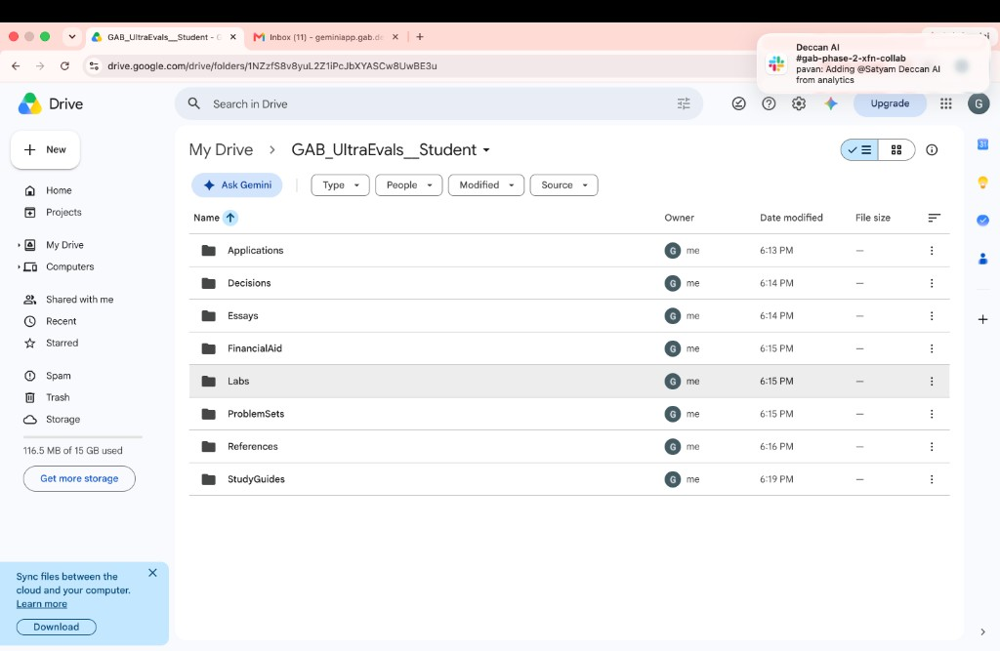

# GAB workspace seed

Seed real Google demo accounts from UltraEvals persona JSON.

This is the **environment setup tool** for GAB, not the rater UI. It takes a persona
(Student, Backend software engineer, …) and writes that persona's Calendar events, Gmail
threads and Drive files into a **real Google demo account**, so an annotator can log into
Gemini as that user and see a populated workspace.

It runs locally on `127.0.0.1:8765`, has no database, and holds no secret on disk other
than the Google OAuth client and the per-account refresh tokens.

**What it never does:** it never automates Google sign-in and never sends the account
password to Google. You sign in yourself in Google's own consent window. The password
column in the CSV exists only so you can copy it into Gemini later; it stays in your
browser tab.

---

## Contents

1. [What you need before you start](#1-what-you-need-before-you-start)
2. [One-time Google Cloud setup](#2-one-time-google-cloud-setup)
3. [Install and run](#3-install-and-run)
4. [Module 01 — CSV and OAuth client](#4-module-01--csv-and-oauth-client)
5. [Module 02 — Authorize each account](#5-module-02--authorize-each-account)
6. [Module 03 — Choose the data for each module](#6-module-03--choose-the-data-for-each-module)
7. [Module 04 — GitHub (optional)](#7-module-04--github-optional)
8. [Module 05 — Push](#8-module-05--push)
9. [Module 06 — Verify](#9-module-06--verify)
10. [Troubleshooting](#10-troubleshooting)
11. [Known limits](#11-known-limits)
12. [Tests](#12-tests)

---

## 1. What you need before you start

| Thing | Notes |
| --- | --- |
| Python 3.12+ | 3.14 is what this was built against |
| The persona tree | `PKJA_UltraEvals_Environments_/`, a **sibling** of `gab-workspace-seed/` |
| A Google Cloud project | You will create an OAuth client in it (section 2) |
| Demo Google accounts | Real Gmail accounts you control the passwords for |
| An accounts CSV | email + persona, password optional |
| A GitHub PAT | Only for the Backend software engineer persona |

The persona tree must sit next to `gab-workspace-seed`, because the app resolves it as
`../PKJA_UltraEvals_Environments_`. A folder counts as a persona only if it contains a
`services/` directory, which is why `Claude outputs/` is ignored — 17 personas are picked up.

Inside each persona, the app reads exactly three files:



- `services/calendar/data.json` → Calendar
- `services/email/data.json` → Gmail
- `services/filesystem/data.json` → Drive
- `services/github/` → optional GitHub tree (only some personas have it)

### The accounts CSV

One row per demo account. Headers are matched case-insensitively:

- **email** — also accepts `Google account`, `account`, `gmail`
- **role** — also accepts `persona`, `Benchmark persona/profile`, `profile`
- **password** — also accepts `pass`, `pwd`. Optional.

```csv
Google account,Password,Benchmark persona/profile
geminiapp.gab.demo.user410@gmail.com,hunter2,Student
geminiapp.gab.demo.user411@gmail.com,hunter3,Applied ML and Data Scientist
```

The role is normalised (lowercased, non-alphanumerics → `_`) and matched against the
persona folder names, so `Applied ML and Data Scientist` matches
`Applied_ML_and_data_scientist`. Unmatched roles are flagged in the table and you pick the
folder from a dropdown. Rows whose email column does not look like an email (`@` plus a dot
in the domain) are skipped with a warning naming the row number — a trailing
`total: 10 accounts` line will not silently become an account.

Non-UTF-8 CSVs are fine. Excel's "CSV (Comma delimited)" export on Windows is cp1252, and
the app falls back utf-8-sig → cp1252 → latin-1, then tells you in the warnings which codec
it used.

---

## 2. One-time Google Cloud setup

Do this once per Google Cloud project. There is no API for most of it, so it is manual.

### 2.1 Create the project and configure the Auth Platform

In [Google Cloud Console](https://console.cloud.google.com), create a project (this guide
uses `gab-env-seed`), then open **Google Auth Platform** and complete the project
configuration wizard — app name, support email, audience, contact info.



Set **User type: External** and leave publishing status on **Testing**.

### 2.2 Enable the three APIs

In **APIs and services → Library**, enable:

- Gmail API
- Google Calendar API
- Google Drive API

The app requests these scopes and no others. Do not widen them:

```
openid
https://www.googleapis.com/auth/userinfo.email
https://www.googleapis.com/auth/gmail.modify
https://www.googleapis.com/auth/calendar
https://www.googleapis.com/auth/drive
```

### 2.3 Add every demo account as a test user

**Google Auth Platform → Audience → Test users → Add users.** Add every address from your
CSV. While the app is in Testing, only listed test users can consent, and the cap is 100
users **for the lifetime of the project** — each address you add consumes that quota
permanently.



This list is manual and there is **no API for it**. Google exposes an API for consent-screen
brands and OAuth clients (`gcloud iap oauth-brands`, `clientauthconfig` permissions), but
nothing that writes test users — not even for a project Owner. The console page is the only
writer, so the app cannot add them for you.

What it can do: after you upload the CSV, module 01 shows **Copy next email (1/N)**. The
Audience *Add users* box commits **one chip per Enter** and never splits a pasted list —
commas and newlines both fail with *"Invalid emails are not allowed"*. Click, paste, press
Enter, then click again for the next address.

If you forget an address, its consent screen fails with an access error.

Publishing the app would remove the test-user requirement, but Gmail and Drive are
*restricted* scopes, so production use requires Google verification and a security
assessment. Switching the audience to **Internal** would also remove it, but that needs the
demo accounts to be Workspace accounts in your own organisation — consumer `@gmail.com`
addresses cannot be Internal.

### 2.4 Create the OAuth client — type **Web application**

**Google Auth Platform → Clients → Create OAuth client.**



Application type must be **Web application**. Add both redirect URIs exactly:

```
http://127.0.0.1:8765/oauth/callback
http://localhost:8765/oauth/callback
```

Then **Create** and **Download JSON**. The file must have a top-level `"web"` object.
A Desktop client (`"installed"`) is rejected by this app — the `populate.py` CLI still
accepts Desktop JSON; the web UI does not.

Keep the downloaded JSON. You upload it in module 01, which copies it to
`gab-workspace-seed/credentials.json`.

---

## 3. Install and run

```bash
cd /path/to/DesignBench/GAB/gab-workspace-seed
python3 -m venv .venv
source .venv/bin/activate
pip install -r requirements.txt
uvicorn app:app --host 127.0.0.1 --port 8765
```

Open **http://127.0.0.1:8765**.

**Do not add `--reload`.** The reloader restarts the worker on any file change and takes
in-flight push jobs with it. Pending OAuth state survives (it is on disk); running jobs do not.

The page is six modules top to bottom: **01 Setup · 02 Authorize · 03 Environment ·
04 GitHub · 05 Push · 06 Verify**. Work them in order. Module 04 only appears when the
selected persona ships a `services/github/` tree.

---

## 4. Module 01 — CSV and OAuth client

Two files, in this order.



**Step 1 — Accounts CSV.** Click *Choose CSV*. The summary line below confirms what was
parsed (`10 accounts · consumer_oauth · 0 authorized · 0 seeded · 0 unmatched personas`)
and the accounts table appears underneath with a row per account: email, persona, auth
chip, drops, push state, verify counts, and the masked password column if your CSV had one.

Passwords are parsed **in the browser only** and are never sent to the server, so they are
gone after a reload — re-upload the CSV to get the *Show* / *Copy* buttons back. If the app
detects quoted CSV fields it warns you, since a password containing a comma can confuse the
in-browser parser.

**Step 2 — OAuth Web JSON.** Either pick the downloaded file or paste the JSON into the
textarea and *Save pasted JSON*. Success looks like the green **web client ready** chip.
The panel echoes the redirect URIs found in the file and flags any missing ones, which is
the fastest way to catch a client whose URIs do not match section 2.4.

**Select a row in the table before moving on** — modules 02 to 06 all act on the selected
account.

---

## 5. Module 02 — Authorize each account

Click **Authorize selected account**. Google's consent window opens.

1. Pick the demo Google account. **Not your own.**
2. Testing-mode apps are unverified, so you get this warning. Click **Continue**.

   

3. Grant Gmail, Calendar and Drive access.

The app then calls Google's userinfo endpoint and compares the address you actually signed
in as against the CSV row. **If they differ, the token is discarded** and the row shows a
`mismatch` chip naming what Google returned. That check is the guardrail against seeding
the wrong mailbox; it runs again immediately before the first write on every push.

Auth chips:

| Chip | Meaning |
| --- | --- |
| `none` | never authorized |
| `authorized` | token valid and the address matched |
| `mismatch` | you signed in as someone else; token discarded |
| `expired` | Testing-mode refresh token aged out (~7 days) — authorize again |
| `unknown` | could not reach Google. Transient. Retry; the table is not cleared |

A verified address is cached next to the token for 10 minutes, so refreshing the page with
ten accounts does not trigger ten userinfo round trips.

Tokens live in `gab-workspace-seed/tokens/<slug>__<hash>.json`, one per account.

---

## 6. Module 03 — Choose the data for each module



**Nothing is pushed until you explicitly choose a file for that module.** A matched persona
is a *suggestion*, not a selection — a row saying Student does not mean Student's JSON is
used. Each of the three slots shows one chip:

- `not selected` (red) — this module will be refused at push time
- `persona — explicit` (green) — you clicked the *Use … JSON* button
- `drop` (amber) — you uploaded a one-off file for this account

Per slot: **Use `<persona>` JSON** binds the persona file, **Drop JSON** uploads a
replacement for this account only, **Clear** unsets it. **Use all three `<persona>`
files** does the common case in one click.

Drops are per account. They live under `runs/<run_id>/<account>/` and never leak to another
row. Uploads stream to disk with a 200 MB cap, so a large filesystem JSON does not sit in
RAM. Dropping a calendar file on the Gmail slot is rejected by content inspection, not by
filename.

### Gmail attachments need the filesystem JSON

Attachment bytes live in the filesystem JSON, not in the Gmail JSON. If you push Gmail
**without** a filesystem source and the mail data references attachments, the push is
refused with `N messages reference attachments; select the filesystem JSON too, or they
will be placeholders`. Either select the filesystem JSON, or tick **Push Gmail anyway** in
module 05 to accept placeholders deliberately.

---

## 7. Module 04 — GitHub (optional)

This module appears only for personas with a `services/github/` tree (Backend software
engineer). It creates a **private** repo under the PAT's GitHub user and force-pushes the
tree. That GitHub account is **not** the demo Gmail — there is no way to create a GitHub
repo "owned by" the Google account. Gemini's GitHub connector authenticates separately.
After the push, copy the repo URL and paste it into Gemini by hand.



Create a **classic** token at [github.com/settings/tokens](https://github.com/settings/tokens)
→ *Tokens (classic)* → *Generate new token (classic)* with **both** scopes:

- **`repo`** — create and write the private repo
- **`workflow`** — required because the persona tree ships `.github/workflows/`

Without `workflow`, the push is rejected outright:

```
! [remote rejected] main -> main (refusing to allow a Personal Access Token to
  create or update workflow `.github/workflows/bazel-build-crossbuild.yml`
  without `workflow` scope)
```

Paste the token and click **Store PAT**. The app calls `GET /user`, reads the
`X-OAuth-Scopes` header, and shows the GitHub login on success. A token missing `workflow`
is still accepted but flagged in red **before** you waste a push on it.

The PAT is held **in memory for this process only**. Restart uvicorn and you paste it again.
It is never written to disk, never logged, and never appears in git's command line (the app
passes it through `GIT_ASKPASS`, not the remote URL).

---

## 8. Module 05 — Push

Checkboxes, and what they actually do:

| Option | Effect |
| --- | --- |
| **Calendar / Gmail / Drive** | Which modules to write. Each needs a source from module 03 |
| **GitHub private repo** | Create + push the repo (needs a PAT) |
| **GitHub → Drive zip** | Upload the tree as `github-repo-snapshot.zip` into the Drive seed folder |
| **Replace previous seed** | Wipe this app's previous seed first. **Leave this on** |
| **Rebase Gmail dates** | Shift mail timestamps so the newest lands about now. On by default |
| **Rebase calendar dates** | Shift events to now. Off by default; forces a calendar wipe |
| **Push Gmail anyway** | Override the attachment guard from module 03 |

Click **Push into Google account**. The log pane streams live over SSE: file reads, rebase
deltas, per-module progress, a grouped skip summary, and the verify line. Every line is
prefixed with `[email]`. Hard failures look like:

`FAIL | account=… | stage=gmail | job=… | file=data.json | error=… | next=what to do`

Those FAIL lines are also appended to `runs/<run_id>/failures.log` so they survive a
refresh. Non-fatal shortfalls (verify counts a bit short, a wipe that failed but the push
continued) are `WARN` lines in the live log only — they do not go in `failures.log`.
Per-item skips (one bad email, one oversized Drive file) stay in the live log with a
`next=` hint and are not written to that file.

The stream survives long quiet stretches (it sends heartbeats) and long runs (lines carry
sequence numbers, so a consumer that has caught up at the 2000-line buffer limit still
receives everything after it).

*Replace previous seed* only removes what this app wrote: seeded Calendar events carry a
private property, seeded mail carries a label, and Drive files live in
`GAB_UltraEvals__<persona>`. Anything the account already had is left alone.

**Push all matched accounts** is deliberately disabled under consumer OAuth, because each
account needs its own interactive consent. It only lights up under Workspace domain-wide
delegation (see `docs/workspace-setup.md`). When it does run, it pre-flights every row —
auth state, sources, persona validity — and refuses the batch with a per-account reason list
rather than failing at account 7 of 10. Child logs are mirrored into the parent pane with an
account prefix. The parent job finishes `failed` if every child failed, `partial` if the
results mixed, and `ok` only if every child succeeded.

### Rebase calendar forces a wipe

Rebasing shifts the `(title, epoch)` dedupe key, so a second run no longer recognises the
first run's events and inserts them again. When **Rebase calendar dates** is on, the
calendar module wipes first and says so in the log.

---

## 9. Module 06 — Verify

After the push, the app reads back from Google and compares counts per module:

- **green** — read-back equals expected
- **amber** — short. Look at the counts and the skip summary, not just the log
- **red** — zero written against a non-zero source

Drive is verified against **attempted** uploads, not the raw file count in the JSON.
`populate_drive` deliberately skips empty-content files, anything over 40 MB, and
undecodable entries, so those are reported separately as *N files not eligible (empty /
oversize)* rather than quietly making a perfect run look amber. `github-repo-snapshot.zip`
is excluded from the count.

Spot-check in the account itself. Drive files land in `GAB_UltraEvals__<persona>`:



---

## 10. Troubleshooting

**`[Errno 48] Address already in use`** — an older uvicorn is still on 8765.

```bash
kill $(lsof -t -iTCP:8765 -sTCP:LISTEN)
```

(That needs `-t`, singular, and will say `kill: not enough arguments` if nothing is listening.)

**Consent fails with an access error** — the address is not on the Audience test-user list (2.3).

**"That file is a Desktop OAuth client"** — the JSON has an `installed` key. Create a Web
application client (2.4).

**Auth chip flipped to `mismatch`** — you picked the wrong Google user in the consent
window. The token was discarded; authorize again and pick the CSV address.

**Refresh mid-push** — the log reconnects automatically. The in-flight job keeps running.

**Auth chip reads `unknown`** — a network blip while checking the address. Retry. Nothing
was lost.

**Push refused: "No source selected for …"** — module 03 slots are still `not selected`.
This is intentional; choose the file.

**Push refused: "N messages reference attachments"** — select the filesystem JSON, or tick
*Push Gmail anyway* (section 6).

**Duplicate calendar events** — you pushed with *Replace previous seed* off, or rebased
without a wipe (section 8).

**Calendar stops partway through a big run** — you hit Google's per-account daily write cap.
The run stops cleanly and reports how many events were unwritten. Re-push with only Calendar
checked after a few hours.

**GitHub push rejected over `workflow`** — the PAT lacks that scope. The app surfaces this
as a one-line message (section 7).

---

## 11. Known limits

- **Single operator per uvicorn process:** one `credentials.json`, one in-memory GitHub PAT,
  one process. Do not share a running instance.
- **Do not run with `--reload`:** in-flight jobs die with the worker. Pending OAuth state
  survives (it is on disk); jobs do not.
- **Google Calendar's per-account daily write cap** can abort a large wipe+insert. The run
  stops cleanly and reports how many events were left unwritten; re-push with only Calendar
  checked after a few hours.
- **Persona folder location** defaults to a `PKJA_UltraEvals_Environments_` directory sitting
  next to this one. If yours lives elsewhere, set `GAB_PERSONA_ROOT=/path/to/personas` before
  starting uvicorn. When the folder is missing, the persona dropdowns are simply empty and you
  drop each JSON by hand — nothing breaks.
- **Test users** on the Google Auth Platform Audience list and the OAuth redirect URIs are
  configured by hand, once per project. There is no API for the test-user list; module 01
  can only copy the addresses to your clipboard for pasting. The 100-user cap is consumed
  permanently per address.
- **Testing-mode consent** expires after about 7 days per account.
- The GitHub repo is created under the PAT's GitHub user, which is unrelated to the Google
  account being seeded. Gemini will not see that repo unless someone pastes the URL into
  the GitHub connector.
- **Loopback only:** the HTTP server rejects any `Host` header that is not `127.0.0.1`,
  `localhost`, or `[::1]`. Bind uvicorn to `127.0.0.1` as documented.
- **A process restart** marks any in-flight push as failed and appends a FAIL line to
  `runs/<run_id>/failures.log`. Re-push that account.
- Tokens written under the old unsuffixed slug (`user410_at_gmail_com.json`) are copied
  onto the collision-proof `…__<hash>.json` name the first time that account is loaded.

Auth backend is chosen with `ENV_LOADER_AUTH_BACKEND` (default `consumer_oauth`). Workspace
domain-wide delegation is implemented but off by default; see `docs/workspace-setup.md`.

There is also a CLI for a single persona, which still accepts a Desktop OAuth client:

```bash
python populate.py --persona Student
```

---

## 12. Tests

```bash
cd gab-workspace-seed
.venv/bin/python -m unittest tests.test_csv_ingest tests.test_authbackend tests.test_edges tests.test_verify tests.test_fail tests.test_reliability -v
```

55 tests, no network access required.
